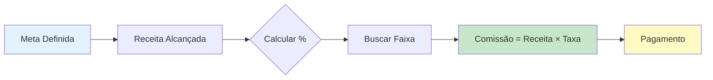
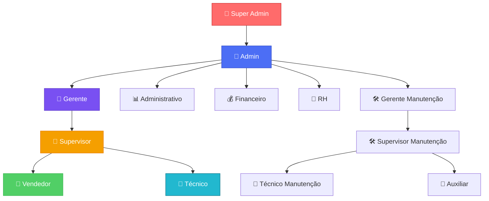
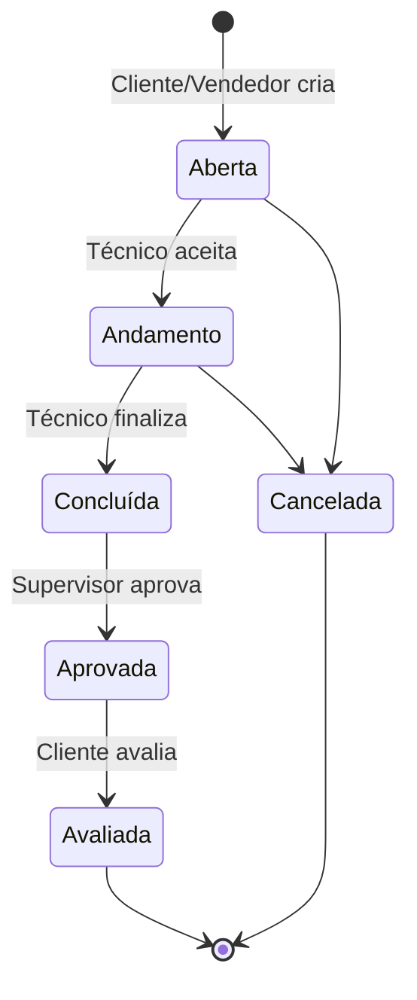
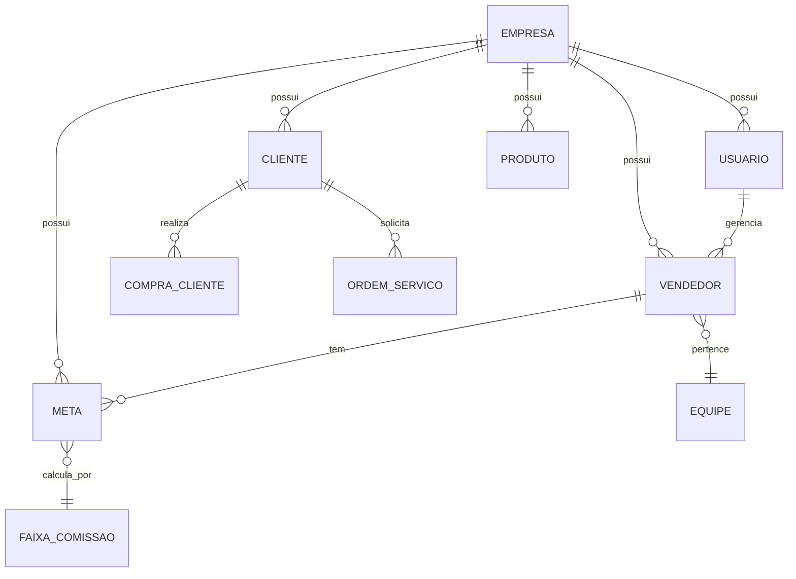

# 🎯 VendaCerta - Sistema de Gestão de Vendas, Metas e Comissões

<div align="center">


**Sistema completo de gestão comercial com CRM, metas, comissões automáticas e ordens de serviço**

[🌐 Demo ao Vivo](https://vendacerta.up.railway.app) • [📚 Documentação](docs/) • [🚀 API REST](docs/API.md) • [🏗️ Arquitetura](docs/ARCHITECTURE.md)

</div>

---

## 📋 Índice

- [Visão Geral](#-visão-geral)
- [Características Principais](#-características-principais)
- [Tecnologias](#-tecnologias)
- [Arquitetura](#-arquitetura)
- [Primeiros Passos](#-primeiros-passos)
- [Módulos do Sistema](#-módulos-do-sistema)
- [API REST](#-api-rest)
- [Deploy](#-deploy-em-produção)
- [Documentação](#-documentação)
- [Licença](#-licença)

---

## 🌟 Visão Geral

**VendaCerta** é uma plataforma completa de gestão comercial desenvolvida para empresas que precisam:

- 📊 **Gerenciar equipes de vendas** com hierarquias complexas
- 🎯 **Definir e acompanhar metas** individuais e de equipe
- 💰 **Calcular comissões automaticamente** com faixas customizáveis
- 📞 **Gerenciar relacionamento com clientes** (CRM integrado)
- 🔧 **Controlar ordens de serviço** de ponta a ponta
- 📦 **Administrar estoque** de produtos e peças

### Por que VendaCerta?

✅ **Multi-tenant**: Suporte a múltiplas empresas isoladas  
✅ **Hierarquias Complexas**: 10 tipos de cargos com permissões granulares  
✅ **Importação Excel**: 3 formatos suportados (11/18/23 colunas)  
✅ **Relatórios Profissionais**: Exportação PDF e Excel  
✅ **API REST Completa**: Integração com outros sistemas  
✅ **PWA**: Instalável como aplicativo mobile  
✅ **Responsivo**: Design mobile-first Bootstrap 5.3.3  
✅ **Produção Ready**: Deploy automatizado no Railway

---

## ✨ Características Principais

### 🎯 Gestão de Metas e Comissões



#### Sistema de Faixas Customizável

| Faixa | Alcance | Taxa | Badge |
|-------|:-------:|:----:|-------|
| **Crítica** | 0-50% | 1% | 🔴 Danger |
| **Baixa** | 50-75% | 2% | 🟡 Warning |
| **Meta** | 75-100% | 3% | 🔵 Info |
| **Boa** | 100-125% | 4% | 🟢 Primary |
| **Excelente** | 125%+ | 5% | ⭐ Success |

**Exemplo de Cálculo**:
```
Meta: R$ 50.000,00
Receita: R$ 53.000,00
Percentual: 106%
Faixa: "Boa" (4%)
Comissão: R$ 2.120,00
```

### 👥 Hierarquia de Permissões



**Cargos Principais** com **permissões granulares por módulo**:
- `pode_gerenciar_empresas`, `pode_gerenciar_usuarios`, `pode_gerenciar_vendedores`
- `pode_gerenciar_metas`, `pode_ver_relatorios`, `pode_exportar_clientes`
- `pode_gerenciar_estoque`, `pode_criar_os`, `pode_aprovar_os`
- ... e mais 15 permissões

Resumo da hierarquia de manutenção e apoio:
- **Gerente de Manutenção (`gerente_manutencao`)**: visão estratégica, pode aprovar/editar qualquer OS e gerenciar supervisores/técnicos
- **Supervisor de Manutenção (`supervisor_manutencao`)**: aprova/reprova OS, atribui técnicos e acompanha todas as OS
- **Técnico (`tecnico`)**: visualiza e atualiza apenas as OS atribuídas a ele
- **Auxiliar (`auxiliar`)**: acesso de apoio (visualização de OS e mensagens internas), sem poderes de criação/edição/aprovação

### 📊 Dashboard Inteligente por Cargo

| Cargo | Dashboard |
|-------|-----------|
| **Super Admin** | Métricas globais de todas as empresas |
| **Admin/Gerente** | Ranking completo, metas da empresa, gráficos |
| **Supervisor** | Performance da equipe, OS pendentes |
| **Vendedor** | Minhas metas, ranking pessoal, comissão |
| **Técnico** | OS atribuídas, avaliações |

### 📞 CRM com Importação Excel

**3 Formatos Suportados**:

1. **Simples** (11 colunas): Código, Nome, CPF/CNPJ, Telefone, E-mail, Cidade, UF, Endereço, Número, Bairro, CEP
2. **Estendido** (18 colunas): + Razão Social, Inscrição Estadual, Data Nascimento, Complemento, Observações
3. **Completo** (23 colunas): + Latitude, Longitude, Vendedor_ID, Data_Cadastro, Ativo

**Validações Automáticas**:
- ✅ CPF/CNPJ com check digit
- ✅ Códigos únicos
- ✅ Atualização se cliente existir
- ✅ Criação se não existir

### 🔧 Ciclo de Vida de OS



---

## 🛠️ Tecnologias

### Backend

| Tecnologia | Versão | Uso |
|------------|--------|-----|
| **Python** | 3.11+ | Linguagem principal |
| **Flask** | 3.0.0 | Framework web |
| **SQLAlchemy** | 2.0.23 | ORM |
| **PostgreSQL** | 15+ | Banco de dados (produção) |
| **SQLite** | 3.x | Banco de dados (dev) |
| **Pandas** | 2.3.3 | Importação/exportação Excel |
| **OpenPyXL** | 3.1.2 | Manipulação XLSX |
| **ReportLab** | 4.0.7 | Geração de PDFs |
| **Gunicorn** | 21.2.0 | WSGI server (produção) |

### Frontend

| Tecnologia | Versão | Uso |
|------------|--------|-----|
| **Bootstrap** | 5.3.3 | Framework CSS responsivo |
| **Bootstrap Icons** | 1.11.3 | Ícones SVG |
| **Chart.js** | 4.4.0 | Gráficos interativos |
| **Google Fonts (Inter)** | - | Tipografia |
| **JavaScript ES6+** | - | Interatividade |

### Segurança & Performance

- **Flask-Login**: Autenticação e sessões
- **Flask-WTF**: Proteção CSRF
- **Werkzeug**: Hash de senhas (bcrypt)
- **Flask-Limiter**: Rate limiting (anti DDoS)
- **Flask-Compress**: Compressão Gzip (70-90%)
- **Flask-Caching**: Cache de relatórios

### Infraestrutura

- **Railway**: Plataforma de deploy
- **PostgreSQL 15**: Connection pooling
- **Nixpacks**: Build system
- **SSL/TLS**: Certificado automático
- **Git/GitHub**: Controle de versão

---

## 🏗️ Arquitetura

### Estrutura do Projeto

```
vendacerta/
│
├── app.py                      # 🚀 Aplicação Flask principal (119 rotas)
├── models.py                   # 🗄️ 16 Models SQLAlchemy
├── forms.py                    # 📋 Formulários WTForms
├── helpers.py                  # 🔧 Funções auxiliares e permissões
├── config.py                   # ⚙️ Configurações (dev/prod)
├── wsgi.py                     # 🌐 Entry point WSGI
│
├── calculo_comissao.py         # 💰 Engine de cálculo
├── pdf_generator.py            # 📄 Geração de PDFs
│
├── templates/                  # 🎨 64 templates HTML
│   ├── base.html              # Layout base Bootstrap
│   ├── dashboard.html
│   ├── clientes/              # 8 templates
│   ├── vendedores/            # 7 templates
│   ├── metas/                 # 4 templates
│   ├── estoque/               # 7 templates
│   ├── os/                    # 6 templates
│   ├── supervisor/            # 4 templates
│   └── super_admin/           # 7 templates
│
├── static/                     # 📦 Arquivos estáticos
│   ├── css/
│   ├── js/
│   └── images/
│
├── migrations_scripts/         # 🔄 Scripts de migração
│   ├── adicionar_supervisor_id.py
│   └── criar_tabelas_estoque.py
│
└── docs/                       # 📚 Documentação completa
    ├── ARCHITECTURE.md        # Arquitetura do sistema
    ├── API.md                 # Documentação API REST
    └── GETTING_STARTED.md     # Guia início rápido
```

### Database Schema (16 Models)



**Models Implementados**:
- Empresa, Usuario, Vendedor, Meta, Equipe
- Cliente, CompraCliente, Produto, EstoqueMovimento
- OrdemServico, Tecnico, Mensagem
- FaixaComissao, FaixaComissaoVendedor, FaixaComissaoSupervisor, Configuracao

---

## 🚀 Primeiros Passos

### Desenvolvimento Local

#### 1. Pré-requisitos

```bash
# Python 3.11+
python --version

# pip
pip --version

# Git
git --version
```

#### 2. Clonar e Instalar

```bash
# Clonar repositório
git clone https://github.com/cristiano-superacao/vendacerta.git
cd vendacerta

# Criar ambiente virtual
python -m venv venv

# Ativar ambiente (Windows)
venv\Scripts\activate

# Ativar ambiente (Linux/Mac)
source venv/bin/activate

# Instalar dependências
pip install -r requirements.txt
```

#### 3. Configurar Banco de Dados

```bash
# SQLite (automático para dev)
python app.py

# OU PostgreSQL (produção)
# 1. Instalar PostgreSQL
# 2. Criar banco: CREATE DATABASE vendacerta;
# 3. Configurar DATABASE_URL em .env
```

#### 4. Executar Aplicação

```bash
# Modo desenvolvimento
python app.py

# Aplicação rodando em http://127.0.0.1:5000
```

#### 5. Acessar Sistema

**URL**: http://127.0.0.1:5000/login

**Credenciais Padrão**:

| Perfil | E-mail | Senha |
|--------|--------|-------|
| **Super Admin** | admin@sistema.com | admin123 |
| **Gerente** | gerente@empresa.com | gerente123 |
| **Supervisor** | supervisor@empresa.com | super123 |
| **Vendedor** | vendedor@empresa.com | vend123 |

> ⚠️ **IMPORTANTE**: Altere as senhas após primeiro acesso!

### Deploy em Produção (Railway)

#### Passo 1: Conectar ao Railway

1. Acesse [railway.app](https://railway.app)
2. Login com GitHub
3. "New Project" → "Deploy from GitHub repo"
4. Selecione `cristiano-superacao/vendacerta`

#### Passo 2: Adicionar PostgreSQL

1. No projeto Railway, clique "New"
2. "Database" → "PostgreSQL"
3. Railway fornece `DATABASE_URL` automaticamente

#### Passo 3: Variáveis de Ambiente

```env
FLASK_SECRET_KEY=gere-uma-chave-forte-de-32-caracteres-aqui
FLASK_ENV=production
FLASK_DEBUG=False
# DATABASE_URL é fornecido automaticamente pelo Railway
```

#### Passo 4: Deploy Automático

```bash
# Cada git push para main dispara deploy
git add .
git commit -m "Deploy to Railway"
git push origin main

# Railway executa automaticamente:
# 1. Build (Nixpacks)
# 2. Instalação de dependências
# 3. Start (Gunicorn)
```

#### Passo 5: Gerar Domínio

1. Settings → Public Networking
2. "Generate Domain"
3. Resultado: `vendacerta-xxxxx.up.railway.app`

**🎉 Pronto! Sistema em produção em ~5 minutos**

---

## 📚 Módulos do Sistema

### 📊 Dashboard

**Recursos**:
- 📈 Métricas em tempo real por cargo
- 🏆 Ranking de vendedores
- 📊 Gráficos de evolução (Chart.js)
- 💰 Totalizadores de metas e comissões
- 🎯 Alertas de metas em risco

**Dashboards Específicos**:
- `/dashboard` - Admin/Gerente (visão geral empresa)
- `/supervisor/dashboard` - Supervisor (visão equipe)
- `/vendedor/dashboard` - Vendedor (visão pessoal)

### 👥 Vendedores

**Funcionalidades**:
- ✅ CRUD completo de vendedores
- 📊 Importação Excel em massa
- 🔐 Criação de logins vinculados
- 🎯 Definição de metas individuais
- 📈 Histórico de performance
- 👔 Vínculo a equipes e supervisores

**Permissões**:
- Super Admin, Admin, Gerente, Supervisor: Full access
- Vendedor: Read-only (próprios dados)

### 🎯 Metas

**Recursos**:
- 📅 Metas mensais por vendedor
- 💰 Cálculo automático de comissões
- ⚙️ Configuração de faixas customizáveis
- 📊 Importação/exportação Excel
- 📄 Relatórios PDF profissionais
- 🔄 Atualização de receitas em tempo real

**Fórmula de Comissão**:
```python
percentual = (receita_alcancada / valor_meta) * 100
faixa = buscar_faixa_por_percentual(percentual)
comissao = receita_alcancada * faixa.taxa_comissao
```

### 📞 Clientes (CRM)

**Características**:
- 📋 Cadastro completo de clientes
- 📊 Importação Excel (3 formatos)
- 🛒 Registro de compras/vendas
- 📈 Histórico de relacionamento
- 🔍 Busca avançada e filtros
- 📤 Exportação CSV (permissionada)

**Validações**:
- CPF/CNPJ com check digit
- Códigos únicos por cliente
- E-mail válido
- Telefone formatado

### 🔧 Ordens de Serviço

**Workflow Completo**:
1. **Criação**: Cliente/Vendedor abre OS
2. **Atribuição**: Técnico aceita
3. **Execução**: Diagnóstico + solução
4. **Aprovação**: Supervisor valida
5. **Avaliação**: Cliente avalia (1-5 ⭐)

**Recursos**:
- 📋 Categorias: Instalação, Manutenção, Reparo, Garantia
- 🚨 Prioridades: Baixa, Média, Alta, Urgente
- 🛠️ Registro de peças utilizadas
- 💰 Cálculo automático de custos
- 📄 Geração de PDF da OS

### 📦 Estoque

**Funcionalidades**:
- 📦 Gestão de produtos
- 📊 Movimentações (entrada/saída/ajuste)
- 🚨 Alertas de estoque baixo
- 💰 Controle de custos e margens
- 📈 Relatórios de inventário
- 📤 Importação/exportação Excel

**Tipos de Movimentação**:
- **Entrada**: Compra de fornecedor
- **Saída**: Venda ou consumo em OS
- **Ajuste**: Inventário ou correção

---

## 🌐 API REST

### Base URL

```
https://vendacerta.up.railway.app
```

### Autenticação

Todas as requisições usam **autenticação via sessão** (cookie).

```http
POST /login
Content-Type: application/x-www-form-urlencoded

email=usuario@empresa.com&senha=senha123
```

### Endpoints Principais

#### GET /api/ranking

Retorna ranking de vendedores ordenado por percentual de meta.

**Parâmetros**:
- `mes` (opcional): Mês (1-12)
- `ano` (opcional): Ano
- `equipe_id` (opcional): Filtrar por equipe

**Resposta**:
```json
{
  "success": true,
  "data": [
    {
      "posicao": 1,
      "vendedor_id": 8,
      "nome": "Maria Santos",
      "meta": 60000.00,
      "receita": 75000.00,
      "percentual": 125.0,
      "comissao": 3750.00
    }
  ]
}
```

#### GET /api/metas/dados-grafico/:vendedor_id

Retorna dados para gráfico de evolução de metas.

**Parâmetros**:
- `meses` (opcional): Quantidade de meses (padrão: 6)

**Resposta**:
```json
{
  "success": true,
  "data": {
    "metas": [
      {
        "mes_ano": "Jan/2025",
        "meta": 50000,
        "receita": 52000,
        "percentual": 104
      }
    ]
  }
}
```

#### GET /api/comissoes/faixas

Retorna faixas de comissão configuradas.

**Resposta**:
```json
{
  "success": true,
  "data": {
    "faixas": [
      {
        "nome": "Excelente",
        "alcance_min": 125,
        "alcance_max": 1000,
        "taxa_comissao": 0.05
      }
    ]
  }
}
```

#### GET /health

Health check completo do sistema.

**Resposta**:
```json
{
  "status": "healthy",
  "database": "ok",
  "version": "2.0.0",
  "excel_available": true
}
```

### Documentação Completa da API

📖 **[Ver documentação completa da API REST](docs/API.md)**

---

## 📖 Documentação

### Guias Completos

| Documento | Descrição |
|-----------|-----------|
| 🏗️ [**ARCHITECTURE.md**](docs/ARCHITECTURE.md) | Arquitetura completa do sistema, diagramas ER, fluxos de trabalho |
| 🚀 [**GETTING_STARTED.md**](docs/GETTING_STARTED.md) | Guia passo-a-passo para cada perfil de usuário |
| 🌐 [**API.md**](docs/API.md) | Documentação completa da API REST com exemplos |

### Estrutura de Arquivos

```
docs/
├── ARCHITECTURE.md          # Arquitetura e diagramas
├── GETTING_STARTED.md       # Guia de início rápido
├── API.md                   # Documentação API REST
├── archive/                 # Documentação arquivada
├── guias/                   # Guias práticos
└── referencias/             # Referências técnicas
```

### Diagramas e Visualizações

A documentação inclui:
- ✅ Diagramas Mermaid (fluxos, ER, hierarquias)
- ✅ Tabelas de permissões
- ✅ Exemplos de código (Python, JavaScript, cURL)
- ✅ Screenshots e wireframes

---

## 🔒 Segurança

### Medidas Implementadas

| Camada | Implementação |
|--------|---------------|
| **Autenticação** | Flask-Login com sessões HTTP-only |
| **Senhas** | Bcrypt hash (cost factor 12) |
| **CSRF** | Flask-WTF em todos os forms |
| **SQL Injection** | SQLAlchemy ORM (parameterized queries) |
| **XSS** | Jinja2 auto-escape |
| **Rate Limiting** | 10 tentativas login/minuto |
| **HTTPS** | Forçado em produção (Railway) |
| **Headers** | CSP, HSTS, X-Frame-Options |
| **Multi-tenant** | Isolamento por empresa_id |
| **Permissões** | 24 flags granulares |

### Compliance

✅ **LGPD**: Dados sensíveis criptografados  
✅ **Multi-tenant**: Isolamento total entre empresas  
✅ **Auditoria**: Logs de todas as ações críticas  
✅ **Backups**: Automáticos diários (Railway PostgreSQL)

---

## 📊 Status do Sistema

| Componente | Status | Versão |
|------------|--------|--------|
| **Sistema** | ✅ Produção | v2.0.0 |
| **URL** | ✅ Ativo | [vendacerta.up.railway.app](https://vendacerta.up.railway.app) |
| **Banco de Dados** | ✅ PostgreSQL | 15 (Railway) |
| **Deploy** | ✅ Automático | Railway + GitHub |
| **SSL/HTTPS** | ✅ Ativo | Certificado automático |
| **Rotas** | ✅ 119 endpoints | Mapeadas e testadas |
| **Templates** | ✅ 64 HTML | Bootstrap 5.3.3 |
| **Models** | ✅ 16 tabelas | SQLAlchemy |
| **Documentação** | ✅ Completa | 100% atualizada |

---

## 📈 Roadmap

### v2.1 - Curto Prazo (Q1 2025)

- [ ] API GraphQL para integração mobile
- [ ] Notificações push PWA
- [ ] Dashboard mobile nativo (React Native)
- [ ] Geolocalização de vendedores em tempo real

### v2.2 - Médio Prazo (Q2-Q3 2025)

- [ ] Integração WhatsApp Business API
- [ ] Machine Learning para previsão de vendas
- [ ] Chat interno em tempo real (WebSockets)
- [ ] Calendário de visitas e agendamentos

### v3.0 - Longo Prazo (Q4 2025+)

- [ ] Migração para microserviços (Flask → FastAPI)
- [ ] Kubernetes deployment
- [ ] Event Sourcing + CQRS pattern
- [ ] GraphQL subscriptions (real-time)

---

## 🤝 Contribuindo

Contribuições são bem-vindas! Por favor:

1. Fork o projeto
2. Crie uma branch para sua feature (`git checkout -b feature/MinhaFeature`)
3. Commit suas mudanças (`git commit -m 'Adiciona MinhaFeature'`)
4. Push para a branch (`git push origin feature/MinhaFeature`)
5. Abra um Pull Request

### Padrões de Código

- **Python**: PEP 8
- **JavaScript**: ES6+
- **HTML/CSS**: BEM methodology
- **Git Commits**: Conventional Commits

---

## 📄 Licença

Este projeto é proprietário e desenvolvido para fins comerciais.  
Todos os direitos reservados © 2024 VendaCerta

---

## 📞 Suporte

### Recursos

- 📚 **Documentação**: [docs/](docs/)
- 🌐 **Sistema**: [vendacerta.up.railway.app](https://vendacerta.up.railway.app)
- 🐙 **GitHub**: [cristiano-superacao/vendacerta](https://github.com/cristiano-superacao/vendacerta)
- 🚂 **Railway Dashboard**: [railway.app/dashboard](https://railway.app/dashboard)

### Contato

Para dúvidas, sugestões ou problemas, abra uma [issue no GitHub](https://github.com/cristiano-superacao/vendacerta/issues).

---

<div align="center">

**VendaCerta v2.0.0** | Desenvolvido com ❤️ usando Python/Flask e Bootstrap  
📅 Última atualização: Dezembro 2024

[⬆️ Voltar ao topo](#-vendacerta---sistema-de-gestão-de-vendas-metas-e-comissões)

</div>
